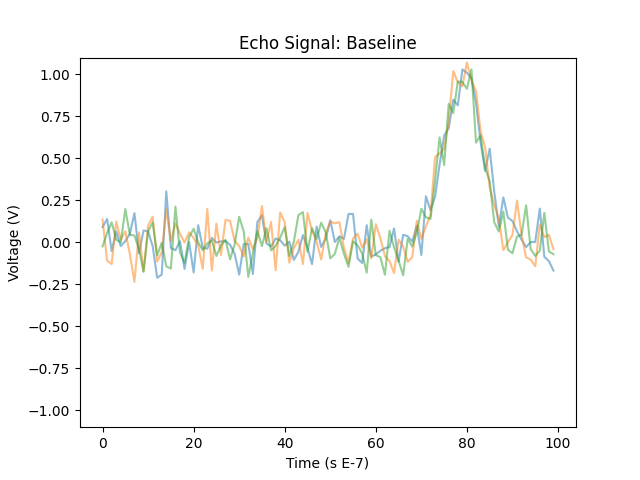
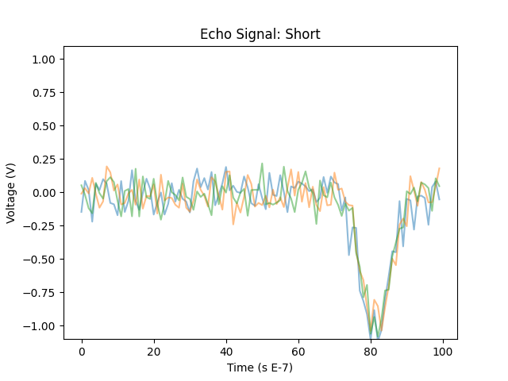
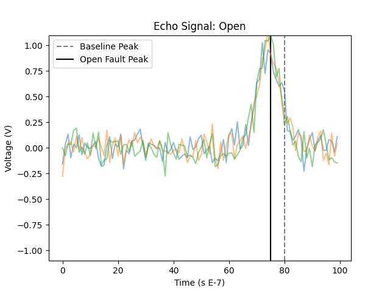
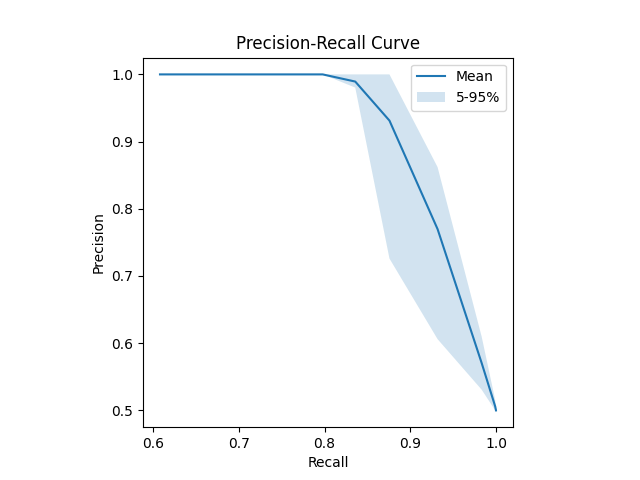
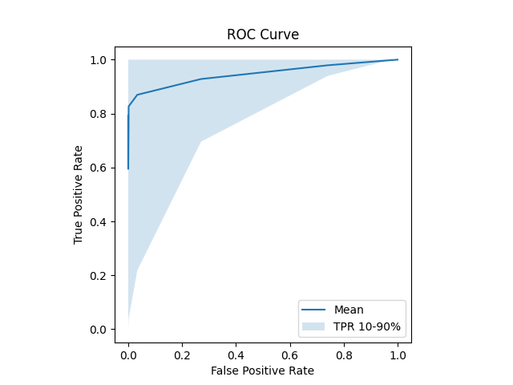

# fault_sim
Experimental tools to simulate, detect, and classify conductive faults. A voltage signal is sent down a length of a conductor, and its echo analyzed for possible issue. 

## Overview 

Experiments are conducted within the imagined simplified production scenario diagramed below.


[diagram](https://excalidraw.com/#json=pEvizIRmO61uVgM_lR85l,ilofvimXC81gyA3azqMzJQ)

I have chosen to separate fault detection (baseline model in green) from classification (in blue) because the business context and purview of each task differs. The binary inference of fault/no fault from an echo forms the bedrock of the modeling task. It needs to be extremely robust, its error rates tightly understood and controlled. False positives waste user resources, false negatives risk environmental and social damage, and both degrade the product and product trust. Classifying faults, on the other hand, is downstream of that modeling task. Misclassifying a signal already known to be a fault is undesirable but not critically so, and if we afford this task flexibility we gain the ability for this model to adapt and grow. See the **Future Work** work section for ideas in this direction. 

I considered alternatives where detection and classification were modeled together, and certainly within the framework described above the two models can interact/share information. But, the rigid requirements of the fault detection model limited the expressivity of the distinct task of classifying faults. 

## Contents 

Files withing the `code/` directory constitue a python package for creating and modeling data, and `experiments/` contains more notebook-style scripts for conducting analysis and producing artifacts. 

### Package

`code/echo_simulator.py` used to generate different sampling scenarios. 
```
python3.12 -m code.echo_simulator -n 3 -o data/short.csv -f short -plot
```

`code/baseline_modelers.py` contains fault detection models, notably the `MahalanobisBaselineModel` which classifies echos according to the [Mahalanobis Distance](https://en.wikipedia.org/wiki/Mahalanobis_distance).

The contents of `code/fault_modelers.py` classify faults using statistical inference and business logic. Currently, they classify hard faults (open and short).


## Experimental Results

Our fault detection model forms the bedrock of the modeling task; it measures the similarity/difference between its training data and a newly encountered echo. A first step is in tuning its sensitivity. The basic premise of this experiment was to 

* Train a baseline fault detection model.
* Sweep across a range of sensitivities, classifying fault and non-fault echos.
* Produce artifacts which enable us to choose the sensitivity that controls error rates. 

The figures below show baseline signal, short faults, and open faults.

<p align="center">
  
  
  
</p>

Originally I had planned on studying short and open faults, but the former (as conceived in this simulation) was not challenging enough to be interesting and the fault classifier was perfect. Since Mahalanobis distance operates on correlations, an inverted signal is extremely disimilar to baseline.

The open fault was more interesting, representing only a shift in echo peak, not inversion. I constructed the problem to be challenging: the baseline peak was located at `0.8 * conductor_length` and the open fault occured at a location uniformly distributed within `(0.7 * conductor_length, 0.9 * conductor_length)`. 

Over 500 simulations, the baseline classifer exhibited the following error rates.

<p align="center">
    
    
</p>

Someone implementing this algorithm could then choose the significance threshold to deploy based on the desired error rates. 

## Future Work

